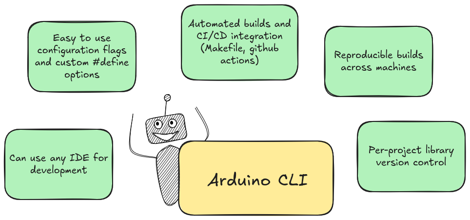

Do you know that you don’t actually need the Arduino IDE to build and upload sketches?

Arduino projects can be compiled and uploaded straight from the command line using the **Arduino Command Line Interface (CLI)**. 
This process is identical to what happens when you build and upload from the IDE, because Arduino IDE 2.0 and later use `arduino-cli` under the hood.

By working directly with the CLI, you remove the IDE as a middle layer and gain more possibilities and control over your builds.

## Reasons to use Arduino CLI

If you were comfortable using IDE, you may not immediately see **why** would you use Arduino CLI instead.

In Arduino Exchange forum you can find suggestion that
> ["If you have to ask what the benefits are then the benefits most likely do not apply to or interest you."](https://arduino.stackexchange.com/questions/56767/what-are-the-benefits-or-advantages-of-arduino-cli). 

That’s not entirely fair, though — it overlooks the fact that people want to learn new things. 
Arduino IDE is great for getting started, but you can do much more if you switch to Arduino CLI:

[//]: # (The names of list items are not matching the sentence flow)

- **Use advanced configuration options**

    Some build or configuration options aren't exposed in the Arduino IDE. 
    It's possible to configure them with configuration files, but this way is more complicated and harder to maintain —
    global configuration would affect all projects, per-board or per-sketch configuration would be time-consuming. 
    With the CLI, you can fully control compiler flags, custom defines and board settings from command line,
    for each project separately.

- **Automate your builds and create CI/CD pipelines**

  Using the CLI, you can easily implement the scripts for tasks like building, uploading, deploying and testing the project.
  These scripts can run on lightweight systems without graphical interface, such as Docker containers.
  This makes possible to integrate Arduino project into the CI/CD pipeline for automated builds and testing.

- **Ensure reproducibility for your builds**

    When working in a team, using the Arduino CLI ensures that everyone builds the project with exactly the same setup and dependencies.
    This helps eliminate the classic “it works on my machine” problem and makes builds consistent across different environments.

- **Use your favourite IDE, not necessarily Arduino IDE**

  You don’t have to use Arduino IDE to develop your projects.
  With the CLI, you can use your favorite code editor 
  — whether it’s for better IntelliSense, built-in integrations like GitHub Copilot, 
 or simply because you’re more comfortable with it.

- **Have full control over project dependencies**

    In Arduino IDE, only one version of a library can be installed at the same time. This becomes a real problem when
    you work on multiple projects that require different versions of the same library. This issue is solved when 
    using CLI — you can specify library versions directly from the command line, ensuring each one uses the correct dependencies.

Hopefully, that was enough to convince you to give the Arduino CLI a try!
Alright, it's time to get our hands dirty. We’ll install the Arduino CLI, set it up, and then build the project from the command line.

## Arduino CLI setup

> If you already have `arduino-cli` installed and working, you can jump to [Basic usage](#basic-usage) chapter.


In September 2024, Arduino released a [major update to Arduino CLI](https://blog.arduino.cc/2024/09/05/arduino-cli-1-0-is-out/).
As of October 2025, the latest version is Arduino CLI 1.3.1, which I'll be using here.
Please refer to [official installation guide](https://docs.arduino.cc/arduino-cli/installation/) to install Arduino CLI on your system.

### Installing Arduino CLI


The quickest way to install the **Arduino CLI** on Linux is with a single command (check for [updates here!](https://docs.arduino.cc/arduino-cli/installation/)):
```
curl -fsSL https://raw.githubusercontent.com/arduino/arduino-cli/master/install.sh | sh
```

Other way, or if you have issues with above command, you can download a prebuilt binary from the **Download** section,
and manually add it to your PATH.


⚠️ **Avoid installing arduino-cli with `snap`.**

The Snap package is not officially supported. It often causes permission and path issues (for example, [this one](https://github.com/arduino/arduino-cli/issues/1543)
— it happened to me when I used snap on Ubuntu 24.04).
If you’ve already installed it with `snap` and it's not working, remove it and reinstall using one of the methods above.


### Check installation
After installing, type `arduino-cli` in your terminal, to confirm that the tool was installed successfully.

```bash
$ arduino-cli
Arduino Command Line Interface (arduino-cli).

Usage:
  arduino-cli [command]
  ...
```

Additionally, check if boards discovery works well:
```bash
$ arduino-cli board list
Port       Protocol Type        Board Name FQBN Core
/dev/ttyS4 serial   Serial Port Unknown
```

All good on my side! 

### Setup your board core

After Arduino CLI is installed, you need to install needed boards definitions [[1]](https://docs.arduino.cc/arduino-cli/getting-started/). First, let's update the board index:
```
arduino-cli core update-index
```

Then you need to install the core relevant for your board. Right now, we don't know which core id we need, 
so let's see what we can choose:
```
$ arduino-cli core search
Downloading index: package_index.tar.bz2 downloaded                                                                                                                                                                                                                                                                           
ID                       Version          Name
arduino:avr              1.8.6            Arduino AVR Boards
arduino:esp32            2.0.18-arduino.5 Arduino ESP32 Boards
arduino:megaavr          1.8.8            Arduino megaAVR Boards
arduino:nrf52            1.0.2            Arduino nRF52 Boards
arduino:renesas_uno      1.5.1            Arduino UNO R4 Boards
arduino:sam              1.6.12           Arduino SAM Boards (32-bits ARM Cortex-M3)
...
```
I have **Arduino Uno R4 WiFi**, so I need to use `arduino:renesas_uno` id.

I will install it with following command:
```
arduino-cli core install arduino:renesas_uno
```

The preparations are done! It was easy, wasn't it?


## Basic usage
To start using Arduino CLI, you actually just need to use three basic commands: create new sketch, 
build a sketch and upload the binary to the board.

### Creating a new sketch

You can create new sketch with
```
$ cd Arduino
$ arduino-cli sketch new MyFirstSketch
Sketch created in: /home/kate/Arduino/MyFirstSketch
```

By default, the sketches are created inside current working directory.

### Compile a sketch
To compile a sketch, use `arduino-cli compile` command followed by:
- `--fqbn <id>` — your board id *(mandatory)*,
- `<sketch root dir>` — the path to root directory of the sketch to compile *(mandatory, unless you're inside the sketches root dir)*,
- `--verbose` — verbose flag to print all build logs to console *(if you want it)*.


I can compile MyBlink sketch with following command:

```bash
arduino-cli compile --fqbn arduino:renesas_uno:unor4wifi --verbose /home/kate/Arduino/MyBlink
```

### Uploading a sketch
Before we jump to upload command, we must now to which port is the board connected. How can we check it?
Good news — no need to observe `ls /dev/tty*` and plug and unplug the board. There is a command for it too:

```
$ arduino-cli board list
Port         Protocol Type              Board Name          FQBN                          Core
/dev/ttyACM0 serial   Serial Port (USB) Arduino UNO R4 WiFi arduino:renesas_uno:unor4wifi arduino:renesas_uno
```

Knowing the port, board id and sketch directory, the upload command looks like this:
```
arduino-cli upload -p /dev/ttyACM0 --fqbn arduino:renesas_uno:unor4wifi --verbose /home/kate/Arduino/MyBlink
```

So it was basically all needed to replace the usage of Arduino IDE **Verify/Compile** and **Upload** actions.

### Serial monitor

If your application sends data using `Serial.write()` or `Serial.print()`, 
you can view it using the `monitor` command in the Arduino CLI.

Make sure the baud rate in your monitor command matches the one you set in your sketch.
For example, if your code includes:
```
Serial.begin(115200);
```
then you should start the `monitor` with the same baud rate:
```
arduino-cli monitor -p /dev/ttyACM0 --config 115200
```

Using serial prints is one of the simplest ways to debug your Arduino applications.

### Basic flow
In summary, the basic `arduino-cli` workflow is as follows:


## Advanced usage

### Specify build folder

By default, Arduino CLI places build artifacts in a temporary, system-specific folder — which can make it hard to inspect.
To keep your build outputs organized and easy to analyze, specify a custom build folder using the `--build-path` flag:

```
$ arduino-cli compile \
  /home/kate/Arduino/MyBlink \
  --fqbn arduino:renesas_uno:unor4wifi \
  --verbose  \
  --build-path /home/kate/Arduino/MyBlink/build
```

Now, all generated files are stored in the `build/` directory within your project:


```
~/Arduino/MyBlink/build$ tree -L 1
.
├── build.options.json
├── compile_commands.json
├── core
├── includes.cache
├── libraries
├── libraries.cache
├── MyBlink.ino.bin
├── MyBlink.ino.elf
├── MyBlink.ino.hex
├── MyBlink.ino.map
└── sketch

4 directories, 8 files
```

This layout makes it much easier to explore build files, inspect compilation issues, or integrate the build with external tools (like static analyzers).

### Optimize for debug
The `--optimize-for-debug` flag adjusts compilation settings to make debugging easier.

You can review or modify its behavior in the `platform.txt` file.
When `--optimize-for-debug` is enabled,
the *debug* version of the optimization flags is applied;
otherwise, the *release* version is used by default.
You can edit these flags in `platform.txt` to customize how each mode behaves.
```
compiler.optimization_flags.release=-Os
compiler.optimization_flags.debug=-Og -g
```

It's good idea to store build files for `debug` and `release` version in separate build folders,
using already discussed `--build-path`:

```
arduino-cli compile --fqbn arduino:renesas_uno:unor4wifi \
  --verbose  /home/kate/Arduino/MyBlink \
  --build-path /home/kate/Arduino/MyBlink/build/debug \
  --optimize-for-debug
  
arduino-cli compile --fqbn arduino:renesas_uno:unor4wifi \
  --verbose  /home/kate/Arduino/MyBlink \
  --build-path /home/kate/Arduino/MyBlink/build/release
```
This way, you have debug optimized version in `MyBlink/build/debug`, and release version in `MyBlink/build/release`.

### Custom defines
Let’s go back to our old MyBlink sketch. Currently, the LED blinks with a hardcoded delay of 1000 ms.
We can make this configurable at compile time by introducing a custom define called `BLINK_FREQUENCY`.

First, update the MyBlink sketch to use the new frequency.
If no value is provided from the command line, it will default to 1000 ms; otherwise, it will use the value you specify.

```
#ifndef BLINK_FREQUENCY
#define BLINK_FREQUENCY 1000
#endif

void loop() {
  Serial.write("Blinking");
  digitalWrite(LED_BUILTIN, HIGH);      // turn the LED on (HIGH is the voltage level)
  delay(BLINK_FREQUENCY);               // wait for a BLINK_FREQUENCY ms
  digitalWrite(LED_BUILTIN, LOW);       // turn the LED off by making the voltage LOW
  delay(BLINK_FREQUENCY);               // wait for a BLINK_FREQUENCY ms
}
```

By adjusting the compile command, you can easily change how fast the LED blinks.
For example, `build.extra_flags="-DBLINK_FREQUENCY=100"` part below sets the blink frequency to 100 ms:

```
arduino-cli compile --fqbn arduino:renesas_uno:unor4wifi --verbose --build-property build.extra_flags="-DBLINK_FREQUENCY=100"
```

### Customizing command

The `platform.txt` file defines the build recipes that the Arduino ecosystem uses to compile, 
link, and package a sketch. These recipes use variables that we can override when we need custom behavior.

Some of these editable variables are:
```
# this can be overriden in boards.txt
build.extra_flags=
build.extra_ldflags=

# These can be overridden in platform.local.txt
compiler.c.extra_flags=
compiler.c.elf.extra_flags=
compiler.S.extra_flags=
compiler.cpp.extra_flags=
compiler.ar.extra_flags=
compiler.objcopy.eep.extra_flags=
compiler.elf2hex.extra_flags=
```

These comments encourage us to override the variables in `platform.local.txt` or `boards.txt`, 
but when using the CLI there is an easier and cleaner approach: 
instead of modifying any files, we can override them directly from the command line using `--build-property`.

This keeps your setup clean and allows you to change the settings for a specific build only.

For example:

```
arduino-cli compile --fqbn arduino:renesas_uno:unor4wifi \
  --verbose \
  --build-property build.extra_flags="-DBLINK_FREQUENCY=100" \
  --build-property compiler.cpp.extra_flags="-pedantic -Werror"
```

## Writing a simple Makefile
As our build command becomes longer, it becomes harder to remember and type correctly each time.
To make it easier, we can wrap these commands inside a script that lives in the root directory 
of the project. This could be a bash script, but an even better option is a Makefile. 
Creating a Makefile for our Arduino project is very simple.

At the top of the Makefile, we define a few variables such as `FQBN` and `PORT`. 
These values are hardcoded for simplicity, feel free to change them to match your board and serial port.

```
# FQBN for your board (change if needed)
FQBN := arduino:renesas_uno:unor4wifi

# Serial port (change if needed)
PORT := /dev/ttyACM0

# Build dirs
BUILD_DEBUG := build/debug
BUILD_RELEASE := build/release

# Arduino CLI executable
ARDUINO_CLI := arduino-cli

# Default build release
all: release

debug:
	$(ARDUINO_CLI) compile \
		--fqbn $(FQBN) \
		--build-path $(BUILD_DEBUG) \
		--optimize-for-debug \
		--verbose

release:
	$(ARDUINO_CLI) compile \
		--fqbn $(FQBN) \
		--build-path $(BUILD_RELEASE) \
		--verbose

upload-debug: debug
	$(ARDUINO_CLI) upload \
		-p $(PORT) \
		--fqbn $(FQBN) \
		--input-dir $(BUILD_DEBUG)

upload-release: release
	$(ARDUINO_CLI) upload \
		-p $(PORT) \
		--fqbn $(FQBN) \
		--input-dir $(BUILD_RELEASE)

monitor:
	$(ARDUINO_CLI) monitor -p $(PORT)

clean:
	rm -rf build


.PHONY: all debug release upload-debug upload-release clean monitor
```

Once the Makefile is in the project root, using it becomes extremely easy:

```
# Build and upload debug
make debug
make upload-debug

# Build and upload release
make release
make upload-release

# Open serial monitor
make monitor

# Clean builds
make clean
```

## Summary
Using the Arduino CLI gives you full control over the build process, 
from compiling to uploading sketches, without relying on the Arduino IDE. 
It’s perfect for automation, reproducibility, and integrating Arduino projects into advanced workflows or CI/CD pipelines.



## More about Arduino CLI
- 📚 [Official documentation of Arduino CLI](https://docs.arduino.cc/arduino-cli/)

- 📚 [Detailed article showing how to install and integrate CLI with VSCode](https://dumblebots.com/blog/arduino-cli-getting-started)

- 🎬 [Arduino CLI - What and Why? | Breaking Out of Arduino IDE | Part 2 | Magpie Embedded on YouTube](https://www.youtube.com/watch?v=Uk5_RKMf2Dk&t=356s)

- 🎬 [Arduino CLI and the art of command line | Sayanee Basu on YouTube](https://www.youtube.com/watch?v=cVod8k713_8)

- 🛠️ [Arduino CLI Manager | interactive shell wrapper for Arduino CLI ](https://github.com/abod8639/arduino-cli-manager)

